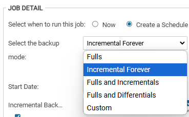
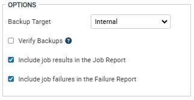

# 백업 모드 및 정책 설정

## 1. Backup Mode
기본적인 스케줄은 일주일 단위로 지정됩니다. 

* Fulls : 스케줄 실행마다 Full Backup을 수행합니다.
* Incremental Forever : 최초 Full Backup을 수행한 이후, 다음 스케줄부터는 증분 백업을 수행합니다.
    * 증분 백업 : Full Backup 이후의 최종 변경분을 기점으로 변경된 부분만 백업받는 것
    * 대략 2주에 한번씩 합성 백업(하나의 Full Backup과 그 뒤의 Incremental Backup을 합성하여 하나의 Synthetic Full Backup으로 만들어주는 것)이 자동으로 수행
    * 변경분을 모두 가지고 있기 때문에 실사용량보다 용량이 크게 나올 수 있음
* Fulls and Incremental : 지정한 요일에 맞춰 Full Backup과 Incremental(증분) Backup을 수행
* Fulls and Differential : 지정한 요일에 맞춰 Full Backup과 Differential(차등) Backup을 수행
    * Differential(차등) Backup : Full Backup이후의 변경된 모든 부분을 백업받는 것
* Custom : 캘린더 양식으로 지정되며, 반복 가능합니다. 

## 2. Backup Schedules
* Start Date : 백업 스케줄이 시작되는 날짜이며, 기본적으로 백업 스케줄을 생성한 날이 Start Date가 됩니다.

* Full(Incremental, Differential) Backup
    * Every : 매주 일 ~ 월 중에서 선택한 요일
    * 1st week : 매 월의 첫번째 주 일 ~ 월 중에서 선택한 요일
    * Bi-weekly : 2주에 한번 일 ~ 월 중에서 선택한 요일

* Start time : 스케줄이 수행되는 시간
* Recurs every : 체크하면 Until에 입력한 시간까지 Hour(s)/Minutes 단위로 반복

* Options
    * Backup Target : Internal로 지정(/backups)
    * Verify Backups : 백업 검증 작업, default는 체크 해제
    * Include job results in the Job Report : 백업 실행 결과를 Job Report에 포함
    * Include job failures in the Failure Report : 백업 실패 결과를 Failure Report에 포함
