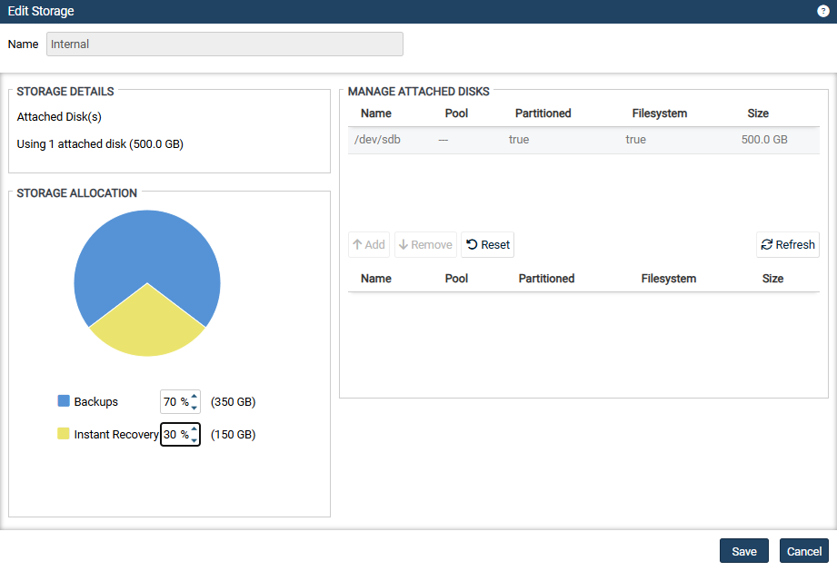
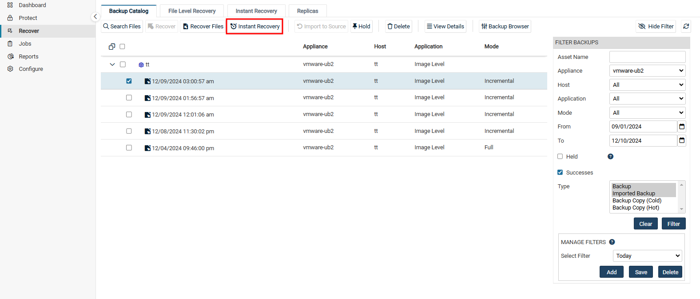

# Instant Recovery(Windows 이미지백업)
즉각 복구(IR)를 수행하면 오류가 발생한 Windows 서버를 복구하여 몇 분 내에 액세스할 수 있습니다. 
즉각 복구를 수행하려면 복구 지점(Recovery Points)과 복구된 대상이 상주할 타겟 위치를 지정합니다.  복구된 대상은 다음 위치에 상주할 수 있습니다.
* VMware ESXi 호스트
* Hyper-V 서버

즉각 복구(IR)는 Unitrends 어플라이언스에서 디스크 이미지 복구 개체와 VM을 생성하며, 타겟 가상 호스트에서 몇 분 만에 완료됩니다. IR VM은 선택한 백업본을 사용하여 생성되며, 원본 Windows 서버와 동일한 네트워크 설정을 가지므로 즉시 실운영환경의 작업을 수행할 수 있습니다. 

IR VM이 생성되면 즉각 복구(IR)는 Unitrends 어플라이언스 내 복구 개체에서 새 VM으로 데이터를 마이그레이션합니다. IR VM은 마이그레이션 동안에도 사용 가능합니다. 

Unitrends 어플라이언스 성능을 위해 IR 세션은 가능한 빨리 종료하는 것이 좋습니다.

## 1. IR 모드
복구는 검증 모드(Audit Mode)와 즉각 복구 모드(Live Mode) 중에서 선택할 수 있습니다. 
검증 모드는 실운영환경에서 실행 중인 Windows 서버의 복구 지점을 검증할 때 사용하고, 즉각 복구 모드(Live Mode)는 오류가 발생한 Windows 서버를 대체할 때 사용합니다.  각 모드에 대한 설명은 아래와 같습니다.: 

> 검증 모드(Audit Mode)
> * 기능 
>   * Windows 이미지 백업을 사용해서 VM이 생성될 수 있는지 확인하는 데 사용됩니다.
> * 작동 방식
>   * Unitrends 어플라이언스는 선택한 백업 데이터를 사용해 어플라이언스에서 디스크 이미지와 새 VM을 생성합니다. 복구가 가상 호스트로 수행되는 경우 VM은 호스트에 생성되지만, 디스크 이미지는 Unitrends 어플라이언스에서 실행됩니다. CPU나 메모리와 같은 나머지 리소스는 가상 호스트에서 작동합니다.
> * 제한 사항
>   * 검증 모드의 VM은 실운영환경에서의 사용을 목적으로 하지 않습니다.
>   * 네트워크 연결이 없으며, 검증 모드에서 VM에 가한 변경 사항은 Unitrends 어플라이언스에서 백업되지 않습니다.
>   * 네트워크 액세스가 필요한 애플리케이션은 검증 모드에서 정상 작동하지 않습니다.
> * 운영 중 원본 Windows 서버에 미치는 영향
>   * 검증 모드의 복구는 원본 Windows 서버에 영향을 주지 않으며, 원본 서버를 종료할 필요가 없습니다.
> * 검증 후 작업
>   * VM이 부팅되고 데이터를 검증한 후, IR 세션을 제거합니다. 이렇게 하면 타겟 호스트에서 IR VM과 복구 개체가 삭제되고, Unitrends 어플라이언스 리소스가 확보됩니다.
 

> 즉각 복구 모드(Live Mode)
> * 기능 
>   * 손상되었거나 장애가 발생한 Windows 서버를 대체하는 데 사용됩니다.
> * 작동 방식
>   * Unitrends 어플라이언스는 선택한 백업 데이터를 사용해 디스크 이미지 복구 객체와 새 VM을 생성합니다. IR VM은 즉시 사용 가능합니다.
> * 세부 사항
>   * Unitrends 어플라이언스는 VMware의 Storage vMotion 또는 Hyper-V의 Storage Live Migration을 사용하여 디스크 이미지 데이터를 타겟 Hyper-V 또는 ESXi 호스트로 복사합니다. 데이터 마이그레이션이 완료되면 IR 세션을 종료해 Unitrends 어플라이언스 리소스를 확보합니다. IR VM은 가상 호스트에 남아 계속 작동합니다.
  

## 2. IR 스토리지 할당

Unitrends 초기 배포 후 서버에 오류가 발생하기 전에 즉각 복구를 위한 영역을 미리 할당해둘 것을 강력히 권장합니다. 필요한 경우 나중에 할당할 수 있지만, 이를 위해서 Unitrends 어플라이언스가 로컬 백업을 정리하여 영역을 확보해야할 수 있습니다. 

(1) <b>Configure → Appliances</b>탭에서 <b>Storage</b>를 선택하고 <b>Edit</b> 버튼을 클릭합니다. 
(2) <b>Instant Recovery</b>의 비율을 수정하고 <b>Save</b>를 클릭합니다. 

## 3. 가상 호스트를 Unitrends 어플라이언스에 추가
IR VM을 생성할 Hyper-V 또는 ESXi 호스트를 선택할 수 있도록, IR에 사용할 가상 호스트를 Unitrends 어플라이언스에 추가해야 합니다.

## 4. 백업 요구사항
즉각 복구를 이해서는 물리적인 Windows 서버의 이미지 백업이 필요하며, 백업에는 모든 중요한 시스템 볼륨이 포함되어야 합니다.

> 주의 사항
>   * 기본적으로 이미지 백업에는 즉각 복구에 필요한 모든 시스템 정보가 포함됩니다. 그러나 백업에서 특정 볼륨을 제외하려는 경우, 부팅 볼륨 및 중요한 시스템(OS) 볼륨을 제외하지 않도록 주의하세요.
>   * IR VM은 선택한 백업 데이터를 기반으로 생성됩니다. 백업에서 제외된 볼륨은 복구되지 않습니다.

## 5. 타겟 대상별 요구사항
IR은 선택한 백업본을 기반으로 VM을 생성합니다. 
IR VM은 ESXi 서버 또는 Hyper-V 서버에 상주할 수 있습니다.  
<b>① VMware ESXi 호스트</b>
* vCenter 버전 및 라이선스
    * Storage vMotion을 지원하는 라이선스가 있어야 합니다.
    * IR을 수행하는 Unitrends 어플라이언스의 대상으로 등록되어야 합니다.
> ※ 참고사항:
> * 단일 ESXi 서버를 사용하면 검증 모드(Audit Mode)는 수행할 수 있지만 즉각 복구 모드(Live Mode)는 지원되지 않습니다.

* ESXi 서버
    * ESXi 버전 5이상을 실행해야 합니다.
    * IR을 수행하는 Unitrends 어플라이언스의 대상으로 등록되어야 합니다.
    * Windows 이미지 백업에 대한 즉각 복구의 경우, 복구하는 Windows 대상의 운영체제를 지원해야 합니다. 
    * IR VM에 대한 충분한 저장소와 리소스가 있어야 합니다.

* IR VM 리소스
IR VM은 원본 대상을 기준으로 리소스가 할당됩니다. 
     * 원본 대상에 6개 이상의 CPU가 있는 경우, IR VM에 4개의 CPU가 할당됩니다.
     * 원본 대상에 2개 이상의 CPU가 있는 경우, IR VM에 2개의 CPU가 할당됩니다.
     * 원본 대상에 2개 미만의 CPU가 있는 경우, IR VM에 1개의 CPU가 할당됩니다.
     
     * 원본 대상에 8GB 이상의 RAM이 있는 경우 IR VM에 8GB가 할당됩니다.
     * 원본 대상에 4GB 이상의 RAM이 있는 경우 IR VM에 4GB가 할당됩니다.
     * 원본 대상에 2GB 이상의 RAM이 있는 경우 IR VM에 2GB가 할당됩니다.
     * 원본 대상에 2GB 미만의 RAM이 있는 경우 IR VM에 1GB가 할당됩니다.

* IR VM 변경성
* 검증 모드(Audit Mode)에서: 
    * IR VM은 네트워크 연결이 없습니다.
    * 검증(Audit) 모드에서 변경한 내용은 Unitrends 백업에 적용되지 않으며, IR 세션을 종료하면 손실됩니다.
* 즉각 복구 모드(Live Mode)에서: 
    * IR VM의 변경사항은 Unitrends 어플라이언스에서 수행되는 원본 대상 백업에 의해 적용되며, IR 세션을 종료한 후에도 유지됩니다.

## 6. IR-검증 모드(Audit Mode) 수행
<b>※ 중요:</b> 수행 전, 미리 IR 스토리지를 적절하게 할당해놔야 합니다. 

(1) <b>Recover → Backup Catalog</b>탭에서 복구 시점(Recovery Points)를 선택합니다.
* 필요에 따라 우측 <b>FILTER BACKUPS</b>에서 날짜 및 표시 형식을 지정할 수 있습니다. 

(2) 시점 선택 후, 상단의 <b>Instant Recovey</b> 버튼을 클릭합니다. 
(3) 검증 모드로 수행하도록 <b>'Recover this VM in Audit Mode'</b> 박스를 체크하여 합니다. 
(4) 복구할 타겟의 위치 세부정보를 입력합니다.
* Target Hypervisor Type
    * 목록에서 타겟 위치 유형을 선택하세요. 
    (VMware Host 또는 Hyper-V Host)
* Target Location
    * 목록에서 VMware 또는 Hyper-V 호스트를 선택하세요.
    * 목록에는 Unitrends 어플라이언스에 추가되어 Windows 대상 시스템과 호환되는 모든 VMware 및 Hyper-V 가상호스트가 표시됩니다.
    * 예를 들어, ESXi 5.1 호스트는 Windows 2016 대상 시스템에 표시되지 않습니다.
* (선택사항)Target Resource Pool
    * VMware 전용이며, VMware 환경에 리소스 풀이 있는 경우에 선택할 수 있습니다.
* Target Storage
    * VM 디스크를 생성하는 데 사용될 데이터 저장소(VMware) 또는 볼륨(Hyper-V)을 선택합니다.
* Target Appliance Network
    * 목록에서 가상 네트워크를 선택하세요.
    * 이 목록에는 VMware 또는 Hyper-V 호스트에서 검색되어 사용할 수 있는 모든 네트워크 스위치가 포함되어 있습니다.

(5) 마지막으로 복구 설정을 검토합니다. 
* 기본적으로 VM 이름은 <b>'<등록된 Windows 서버 이름>_restore'</b>로 생성됩니다. 
* 연필 아이콘을 클릭하여 VM 이름을 변경할 수 있습니다. 
(6) 검토 후 <b>Save</b>를 클릭하여 복구를 시작합니다. 

(7) <b>(필요한 경우) 오류나 경고 메세지를 처리:</b> 
* Error - 오류가 표시되면 <b>Back</b>을 눌러 문제를 해결하세요.
* Warning - 경고 메시지가 표시되면 <b>Back</b>을 눌러 경고를 해결하거나, <b>Continue</b>를 눌러 경고 조건을 해결하지 않고 IR VM을 만듭니다.

(8) <b>Recover → Instant Recovery</b> 탭에서 세부 정보를 보고 IR 진행상황을 확인합니다.

> <b>※ 참고:</b> 
>* 종속된 증분 백업이 많을수록 IR VM을 만드는 데 시간이 더 걸릴 수 있습니다.
>* 데이터 검증을 마친 후, 가능한 빨리 IR 세션을 제거해야 합니다.
 

## 7. IR-즉각 복구 모드(Live Mode) 수행

> ※ 권장사항:
> * 즉각 복구 모드는 일시적으로 사용해야 합니다.
> * Unitrends 어플라이언스는 Live IR VM이 14일동안 실행된 경우 경고를 보내기 시작합니다.
> * 장애가 발생한 서버를 새 하드웨어로 복구한 후 IR  세션을 종료하거나, IR VM을 영구적으로 대체 용도로 사용할 수 있습니다.
> * Live IR VM은 하이퍼바이저 리소스를 사용합니다.  VM 데이터가 하이퍼바이저로 마이그레이션되는 즉시 IR 세션을 종료합니다.  이렇게 하면 IR 세션만 제거되며, IR VM은 타겟 하이퍼바이저에서 완벽하게 정상 작동합니다.

아래 절차를 실행하기 전에 원본 Windows 서버를 종료하세요. 

(1) <b>Recover → Backup Catalog</b>탭에서 복구 시점(Recovery Points)를 선택합니다.
* 필요에 따라 우측 <b>FILTER BACKUPS</b>에서 날짜 및 표시 형식을 지정할 수 있습니다. 

(2) 시점 선택 후, 상단의 <b>Instant Recovey</b> 버튼을 클릭합니다. 
(3) 검증 모드로 수행하도록 <b>'Recover this VM in Audit Mode'</b> 박스를 선택하지마세요. 
(4) 복구할 타겟의 위치 세부정보를 입력합니다.
* Target Hypervisor Type
    * 목록에서 타겟 위치 유형을 선택하세요. 
    (VMware Host 또는 Hyper-V Host)
* Target Location
    * 목록에서 VMware 또는 Hyper-V 호스트를 선택하세요.
    * 목록에는 Unitrends 어플라이언스에 추가되어 Windows 대상 시스템과 호환되는 모든 VMware 및 Hyper-V 가상호스트가 표시됩니다.
    * 예를 들어, ESXi 5.1 호스트는 Windows 2016 대상 시스템에 표시되지 않습니다.
* (선택사항)Target Resource Pool
    * VMware 전용이며, VMware 환경에 리소스 풀이 있는 경우에 선택할 수 있습니다.
* Target Storage
    * VM 디스크를 생성하는 데 사용될 데이터 저장소(VMware) 또는 볼륨(Hyper-V)을 선택합니다.
* Target Appliance Network
    * 목록에서 가상 네트워크를 선택하세요.
    * 이 목록에는 VMware 또는 Hyper-V 호스트에서 검색되어 사용할 수 있는 모든 네트워크 스위치가 포함되어 있습니다.

(5) 마지막으로 복구 설정을 검토합니다. 
* 기본적으로 VM 이름은 <b>'<등록된 Windows 서버 이름>_restore'</b>로 생성됩니다. 
* 연필 아이콘을 클릭하여 VM 이름을 변경할 수 있습니다. 
(6) 검토 후 <b>Save</b>를 클릭하여 복구를 시작합니다. 

(7) <b>(필요한 경우) 오류나 경고 메세지를 처리:</b> 
* Error - 오류가 표시되면 <b>Back</b>을 눌러 문제를 해결하세요.
* Warning - 경고 메시지가 표시되면 <b>Back</b>을 눌러 경고를 해결하거나, <b>Continue</b>를 눌러 경고 조건을 해결하지 않고 IR VM을 만듭니다.

(8) <b>Recover → Instant Recovery</b> 탭에서 세부 정보를 보고 IR 진행상황을 확인합니다.

## 8. IR 진행현황 확인
<b>Recover → Instant Recovery</b>탭에서 활성 IR 세션이 이름별로 나열됩니다. 
생성한 IR 세션을 선택하고 <b>View Details</b>버튼을 클릭합니다.
<i>Details</i>탭에 상태 메세지가 표시됩니다. <b>"VM is available for use."</b>메세지가 나타나면 데이터 마이그레이션이 완료된 것입니다.

## 9. IR 세션 종료
> 검증 모드(Audit Mode)로 실행 중인 IR VM
> * IR 세션을 종료하면 Unitrends 어플라이언스에서 복구 객체와 가상 호스트(Hyper-V 또는 ESXi)에서 IR VM이 제거됩니다.
> * 주의: 더 이상 IR VM을 사용하지 않을 때만 IR 세션을 종료하세요.
> 즉각 복구 모드(Live Mode)에서 실행 중인 IR VM
> * IR 세션 종료 시 Unitrends 어플라이언스에서 복구 개체는 제거되지만, IR VM은 가상 호스트에 남습니다.
> * 주의: 데이터 마이그레이션이 완료되고 VM이 사용 준비 상태가 될 때까지 IR 세션을 종료하지마세요. 너무 일찍 종료하면 IR VM이 유효하지 않게되며, 새 IR VM을 생성해야할 수도 있습니다.

(1) <b>Recover → Instant Recovery</b> 탭을 클릭하니다.
* 활성화된 IR 세션이 이름별로 표시됩니다.
(2) 종료할 IR 세션을 선택합니다.
(3) <b>Tear Down</b>버튼을 클릭하고 <b>Confirm</b>을 클릭합니다.

### 9-1. 세션 종료 후 결과
* 검증 모드(Audit Mode)로 VMware 또는 Hyper-V 호스트에서 실행 중인 IR VM
    * IR VM이 가상 호스트에서 제거됩니다.
* 즉각 복구 모드(Live Mode)로 VMware 또는 Hyper-V 호스트에서 실행 중인 IR VM
    * IR VM은 가상 호스트에 남아 계속 작동합니다.

