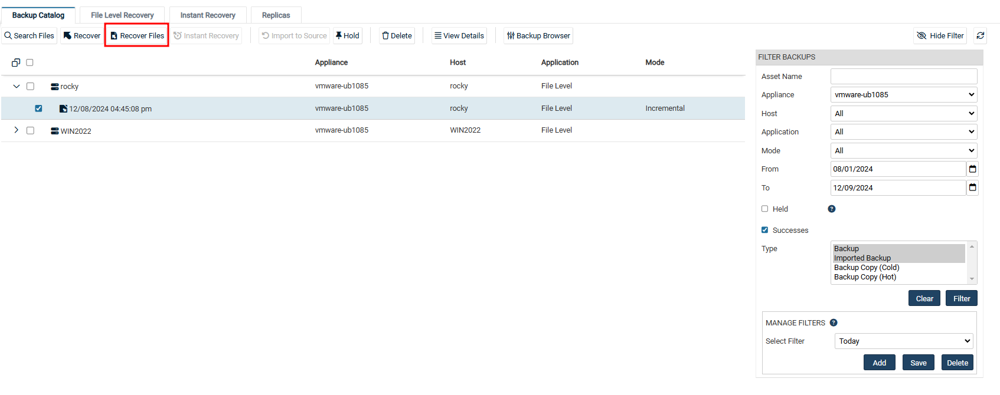
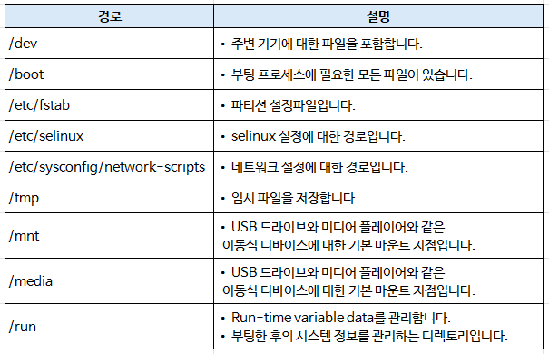

# Linux 복구 방법

> ※ Linux의 경우, Unitrends 어플라이언스에서 복구하려는 해당 Linux에 맞춰 BMR 부팅CD 제작을 지원하지 않기에 아래 단계로 Linux 복구를 진행해야 합니다. 

## 1. 사전 필수요건
* 복구 대상 서버에 복구하려는 Linux 대상서버와 동일하게 파티션을 구성하여 OS를 설치합니다.
* 복구 대상 서버에 Unitrends Agent 설치하여, Unitrends 어플라이언스에 등록합니다.

## 2. Linux 복구 단계
위 '사전 필수요건'이 수행되었다는 가정하에 아래 단계가 진행됩니다.

(1) <b>Recover → Backup Catalog</b>의 오른쪽 <b>FILTER BACKUPS</b>를 사용하여 복구하고자 하는 기간을 지정합니다.

(2) 복구할 대상 시스템을 확장하여 <b>복구 시점(Recovery Points)</b>을 선택합니다.

(3) 상단의 <b>Recover Files</b> 버튼을 클릭합니다.

(4) <b>FILE Browser</b>에서 아래 이미지의 영역은 복구에서 제외합니다.
* > 버튼 : 특정 파일/폴더를 Inclusion 및 Exclusion에 포함
* < 버튼 : 특정 파일/폴더를 Inclusion 및 Exclusion에 제외
* << 버튼 : 특정 파일/폴더를 Inclusion 및 Exclusion에 모두 제외

(5) 복구할 파일 및 폴더의 적용이 완료되면 <b>Next</b>를 클릭합니다.

(6) <b>복구 옵션(RECOVERY OPTIONS)</b>을 설정합니다.

<b>[RESTORE TARGET]</b>
* Asset : 
    * 복구할 대상을 선택합니다.
    * 기본값은 백업본 대상 서버입니다.
* Directory : 
    * 복구 대상 서버에서 복구될 경로를 선택합니다.
    * 기본값으로 선택하지 않으면 백업본의 위치 그대로 적용됩니다.

<b>[EXCLUSIONS]</b>
* Exclusion Pattern :
    * 제외할 파일의 패턴을 사용하여 추가합니다.
* Exclusion List : 
    * 위에서 추가한 제외할 파일의 패턴 리스트가 나열됩니다.

<b>[ADVANCED OPTIONS]</b>
* Commands to run pre-restore : 
    * 복구 전에 실행할 스크립트 혹은 명령어를 추가할 수 있습니다.
* Commands to run post-restore : 
    * 복구 후에 실행할 스크립트 혹은 명령어를 추가할 수 있습니다.

<b>[CHECKBOX]</b> 
기본적으로 체크되어 있는 옵션은 권장사항이므로 유지하는 것이 좋습니다.
* Preserve Directory Structure : 원본 디렉토리 구조를 유지하여 복구합니다.(기본값)
* Overwrite existing Files : 복구 경로에 동일한 파일이 있으면 덮어씁니다.(기본값)
* Restore newer files only : 복구 경로에 동일한 파일이 있으면 해당 파일은 복구에서 스킵합니다.
* Set file dates to today : 복구할 파일의 날짜를 오늘 날짜로 지정합니다.
* UNIX text conversion : UNIX 운영체제로 복구할 시, text 변환을 수행합니다.(기본값)

(7) 설정을 마치면 <b>Save</b>를 클릭하여 복구를 시작합니다.   

