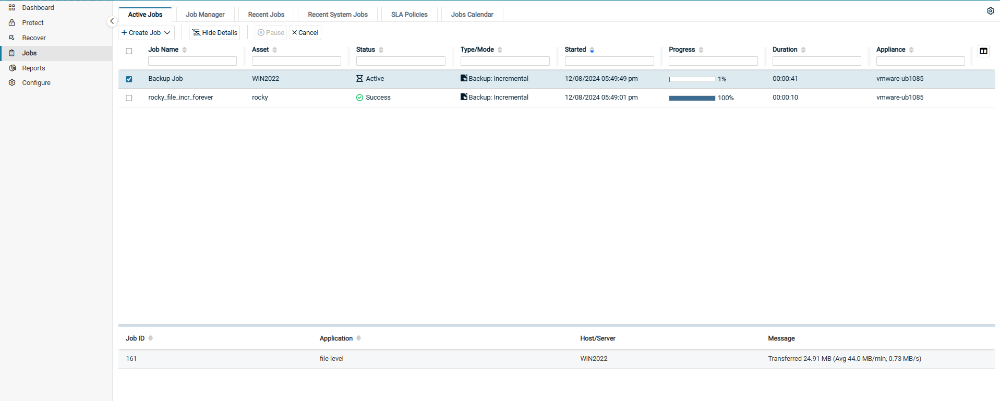
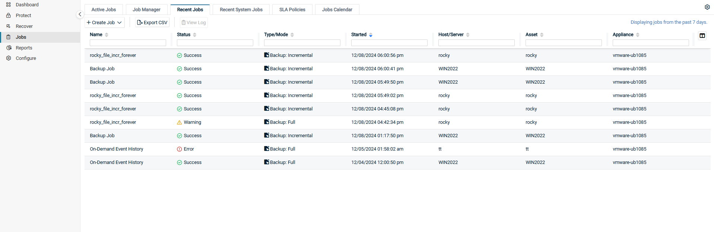
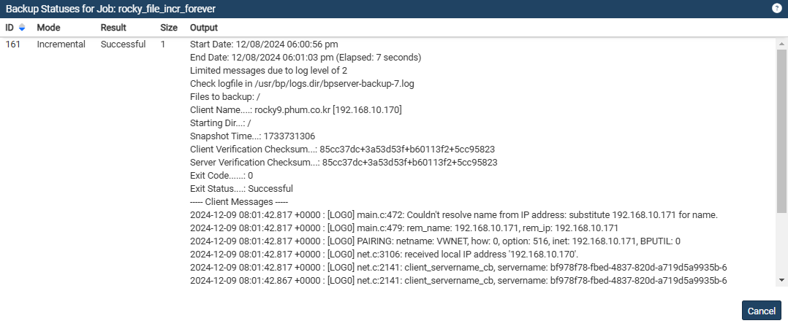
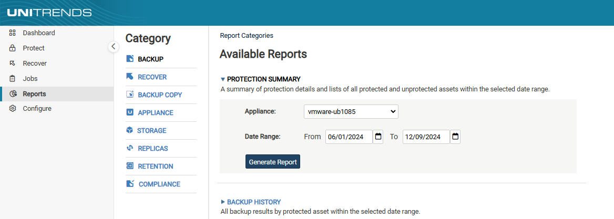

# 모니터링 방법

## 1. Active Jobs
<b>Jobs → Active Jobs</b>탭은 현재 실행 중인 모든 작업과 실행 대기 중인 모든 작업의 실시간 리스트를 제공합니다. 
작업 세부 정보를 확인하려면 아래 단계를 따르세요. 
(1) <b>Jobs → Active Jobs</b>탭을 클릭합니다. 
(2) 확인할 작업을 선택하고 <b>View Details</b>버튼을 클릭합니다. 
(3) 작업 세부 정보가 나열됩니다. 

* Job ID : 작업에 할당된 시스템 생성 ID 번호입니다.
* Application : 
    * Host-Level 백업의 경우, 가상호스트 유형을 포함합니다.
        * ex) VMware, XenServer, Hyper-V 2012 R2
    * Application 백업의 경우, Application 유형을 포함합니다.
        * ex) SQL Server 2012, Oracle 11, Exchange 2013
    * 에이전트 기반의 백업의 경우, 파일 백업 또는 이미지 백업을 포함합니다.
    * System Metadata에는 Unitrends 어플라이언스 구성 및 설정과 같은 시스템 정보가 포함됩니다. 이 시스템 정보의 변경 사항이 감지되면 Backup Copy 작업 중에 System Metadata가 대상 서버에 복사됩니다.
* Host/Server : 가상 호스트 또는 물리 서버의 이름입니다.
* Message : 작업 중에 생성된 시스템 생성 메세지입니다.

(4) <b>Hide Details</b>버튼을 클릭하면 원래 페이지 보기형식으로 돌아갑니다.

## 2. Recent Jobs
<b>Jobs → Recent Jobs</b>탭은 최근 7일동안의 작업 결과를 보여줍니다. 
최근 7일 간의 작업 내역을 확인하려면 아래 단계를 따르세요. 
(1) <b>Jobs → Recent Jobs</b>탭을 클릭합니다. 
(2) 최근 7일 간의 작업 내역이 목록으로 나타납니다. 

각 열에 대한 정보는 다음과 같습니다. 
* Name : 스케줄의 이름
* Status : 작업의 최종 상태.
    * success(초록색) : 성공적으로 작업이 완료되었습니다.
    * warning(노란색) : 경고와 함께 작업이 완료되었습니다.
    * error(빨간색) : 오류가 발생하여 작업이 완료되었습니다.
* Type/Mode : 작업 유형(backup, backup copy 또는 restore) 및 모드(Full, Incremental, Differential 또는 Selective)
* Started : 작업이 시작된 날짜와 시간입니다.
* Host/Server : 가상 호스트와 물리 서버의 이름입니다.
* Asset : 작업이 실행된 대상의 이름입니다.
* Appliance : 작업을 실행한 Unitrends 어플라이언스의 이름입니다.
* Application : 
    * Host-Level 백업의 경우, 가상호스트 유형을 포함합니다.
        * ex) VMware, XenServer, Hyper-V 2012 R2
    * Application 백업의 경우, Application 유형을 포함합니다.
        * ex) SQL Server 2012, Oracle 11, Exchange 2013
    * 에이전트 기반의 백업의 경우, 파일 백업 또는 이미지 백업을 포함합니다.
    * System Metadata에는 Unitrends 어플라이언스 구성 및 설정과 같은 시스템 정보가 포함됩니다. 이 시스템 정보의 변경 사항이 감지되면 Backup Copy 작업 중에 System Metadata가 대상 서버에 복사됩니다.
* Size(MB) : 데이터 크기입니다.(MB)
* Files : (해당되는 경우) 파일 개수입니다.
* ID : 작업에 할당된 시스템 생성 ID 번호입니다.

(3) 작업을 선택하고 <b>View Log</b>를 클릭하면 해당 로그를 확인할 수 있습니다.

## 3. Reports
<b>Reports → Backup</b>탭은 지정한 날짜에 맞춰 작업 레포트 리스트를 제공합니다. 
백업 작업 레포트를 확인하려면 아래 단계를 따르세요. 
(1) <b>Reports → Backup</b>탭을 클릭합니다. 
(2) <b>BACKUP HISTORY</b> 탭을 클릭하여 Date Range를 조정하여 확인할 날짜 범위를 지정합니다.(From/To)
(3) <b>Generate Report</b> 버튼을 클릭하여 레포트를 생성합니다.

(4) 다음과 같이 표시되는 목록을 커스텀할 수 있습니다.
* 입력한 문자열이 표시된 행만 표시하려면 열의 필터 영역에 텍스트를 입력하세요.
* 하단에 'rows per page'에서 값을 선택하여 각 페이지에 표시되는 행 수를 수정할 수 있습니다.