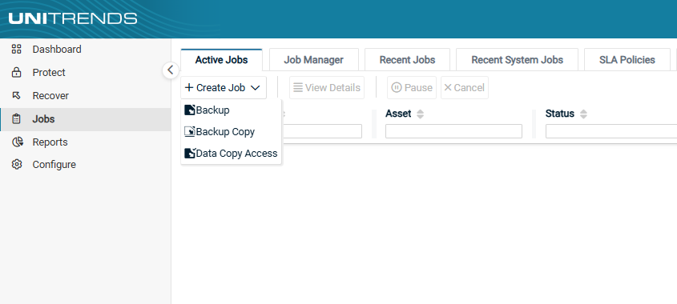
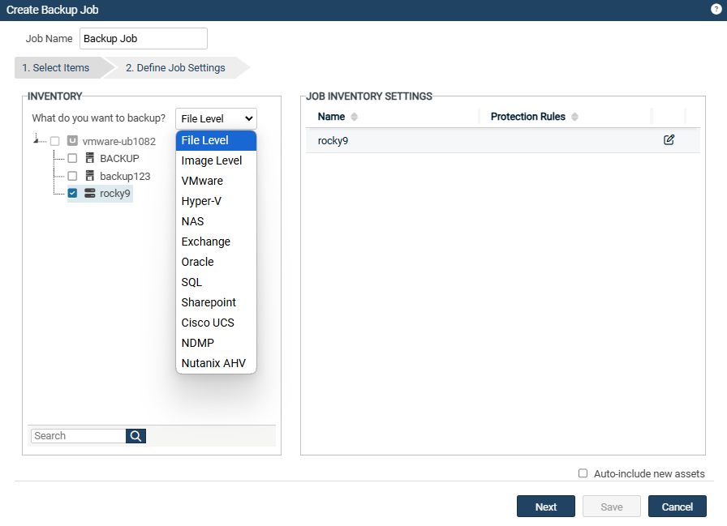
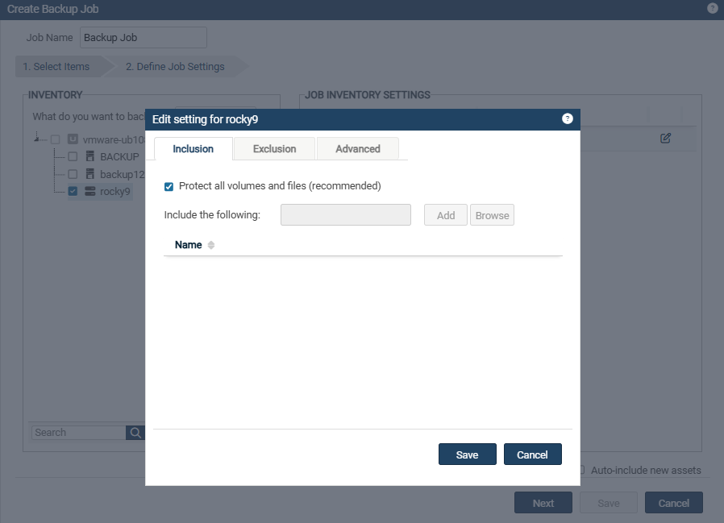
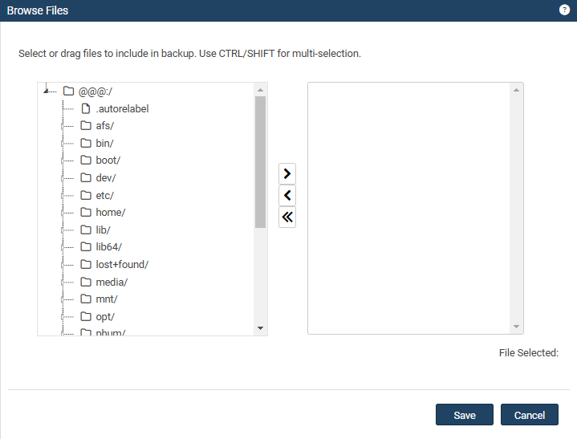

# 이미지 백업(Image-Level Backup)

  
Windows 이미지 백업은 블록 가속화(block acceleration) 기술을 사용하여, 특히 수백만 개의 파일이 있는 Windows 서버에서 매우 빠른 백업 성능을 제공합니다. Windows 대상이 디스크 및 볼륨 단위로 백업되기 때문에, 이미지 백업은 파일 백업보다 더 빠른 성능을 제공합니다. 이러한 백업 속도의 향상 덕분에, 더 자주 스냅샷을 생성하여 장애 발생 시 데이터 손실을 최소화할 수 있습니다.   

※ 참고: 
Azure와 Amazon Web Services(AWS) 환경에서는 이미지 백업이 지원되지 않습니다. 대신 에이전트 기반의 파일 백업 및 애플리케이션 백업을 사용하세요.  

<h4>Windows 이미지 백업을 위한 모범 사례 및 고려 사항</h4> 
 • Microsoft의 권장 사항을 준수하세요. 
 • 이미지 백업은 전체(Full) 백업과 증분(Incremental) 백업을 지원합니다. 
 • 디스크 또는 볼륨 구성에 변경 사항이 있는 경우 새 전체(Full) 백업이 필요합니다. 이는 디스크의 개수, 크기, 속성 또는 볼륨의 개수, 크기, 속성에 변경이 있을 때를 포함합니다.  

※ 중요 참고사항: 
 • 디스크 또는 볼륨 구성 변경 시 
 이전 백업 이후 디스크 또는 볼륨 구성에 변경이 발생하면, 유니트렌드는 다음 백업을 자동으로 전체 백업(Full Backup)으로 전환합니다. (증분 백업을 수동으로 시도하는 경우 전체 백업이 필요하다는 메시지를 표시합니다.)
한 번의 전체 백업이 성공적으로 수행되면, 이후 증분 백업은 예약된 대로 실행됩니다.  

 • 하나의 대상을 여러 유니트렌드로 백업하지 마세요. 
 단일 이미지 백업 대상을 여러 유니트렌드에서 백업하는 것은 권장되지 않습니다. 한 유니트렌드에서 백업을 실행할 때마다 다른 유니트렌드에서의 증분(Incremental) 백업 체인의 무결성이 손상됩니다. 손상된 백업 체인을 복구하기 위해, 유니트렌드는 다음 증분 백업을 자동으로 전체(Full) 백업으로 전환합니다. 이로 인해 여러 기기에서 증분 백업을 실행하면 많은 전체 백업이 생성될 가능성이 높습니다.  

<h4>Windows 이미지 백업 요구사항</h4>
Windows 대상에 대한 이미지 백업을 위해 다음 요구사항을 충족해야 합니다:
<h5>▪ 항목별 요구사항</h5>
1. 유니트렌드 어플라이언스 
• 유니트렌드 어플라이언스는 10.3 이상(Windows 이미지 복제 기능을 사용하려면 10.5.1 이상)을 실행 중이어야 합니다. 
• Windows 대상에서 유니트렌드 어플라이언스로 인바운드 443/TCP 포트가 열려 있어야 합니다.  

2. Windows 에이전트 
• Windows 대상에서 유니트렌드 에이전트는 10.3 이상 버전을 실행 중이어야 하며, Volume CBT 드라이버가 설치되어야 합니다. (Windows 이미지 복제 기능을 사용하려면 에이전트 버전 10.5.1 이상이 필요) 
• Volume CBT 드라이버 설치 옵션은 유니트렌드 에이전트 설치 중에 표시됩니다. 
&nbsp; &nbsp; &nbsp; &nbsp; • Volume CBT 드라이버는 Windows 이미지 증분 백업을 실행하는 데 필요합니다. 
&nbsp; &nbsp; &nbsp; &nbsp; • Volume CBT 드라이버는 설치 후 <b>Windows 대상을 재부팅해야 활성화</b>됩니다. 

※ 참고 사항:  
• Volume CBT 드라이버가 설치되지 않았거나 활성화되지 않은 경우, 이미지 증분 백업은 지원되지 않습니다. 
&nbsp; &nbsp; &nbsp; &nbsp; • 다음 증분 백업 스케줄은 자동으로 전체(Full) 백업으로 전환됩니다. 
&nbsp; &nbsp; &nbsp; &nbsp; • 수동으로 증분 백업을 실행하려고 하면 "전체 백업만 지원된다"는 메시지가 표시됩니다. 
• Hyper-V 서버의 제한 사항: 
&nbsp; &nbsp; &nbsp; &nbsp; • Hyper-V CBT 드라이버는 10.1.0-3 이전 버전의 에이전트를 실행하는 Hyper-V 서버에 설치할 수 없습니다. 
&nbsp; &nbsp; &nbsp; &nbsp; • 이 경우, 최신 에이전트를 설치하기 전에 이전 Windows 에이전트를 수동으로 제거해야 합니다. 자세한 내용은 [Windows 에이전트 제거](To uninstall the Windows agent)를 참조하세요. 

<h4> ▪ 파일 레벨 백업 요구사항 </h4>
※ 파일 레벨 백업을 위해서는 대상 시스템에 Unitrends 에이전트를 설치해야 합니다. 
에이전트 설치 절차는 운영체제에 따라 다르므로, 자세한 내용은 [Unitrends 에이전트 설치 가이드]를 참고하세요.  
에이전트 설치 후, [에이전트 기반의 백업 대상 추가] 페이지를 참조하여 대상을 유니트렌드 어플라이언스에 추가한 다음,
백업 정책을 생성합니다.

  
<h4> ▪ 파일 백업 정책 설정 단계</h4>
(1) <b>Jobs → +Create Job</b> 버튼을 클릭하여 <b>Backup</b>을 선택합니다.  

(2) 좌측 <b>INVENTORY</b> 영역에서 토글을 열어 백업 대상을 선택합니다. 
&nbsp; &nbsp; &nbsp; &nbsp; - 백업 대상을 등록된 이름으로 찾으려면 아래 <b>Search</b> 필드를 사용하세요. 
&nbsp; &nbsp; &nbsp; &nbsp; - 기본적으로 유니트렌드에 등록된 대상만 나열됩니다. 
&nbsp; &nbsp; &nbsp; &nbsp; - <i><b>What do you want to backup?</b></i>에서 백업 유형을 선택합니다. 
&nbsp; &nbsp; &nbsp; &nbsp; &nbsp; ex) File Level, Image Level, VMware, SQL 등  

(3) 우측 <b>JOB INVENTORY SETTINGS</b>의 <b>Edit</b>을 눌러 포함하거나 제외할 백업 경로를 선택합니다. 
(대상 시스템 전체를 백업하는 경우, 이 단계는 넘어가도 됩니다.)  
&nbsp; &nbsp; &nbsp; &nbsp; • <b>Inclusion</b> : 백업받을 파일 및 폴더를 선택하는 곳입니다. 이외 경로는 자동으로 제외됩니다. 
&nbsp; &nbsp; &nbsp; &nbsp; &nbsp; - 기본적으로 체크되어 있는 <b>Protected all volumes and files(recommended)</b>를 체크 해제한 후, 활성화 된 <b>Browse</b>를 눌러 선택합니다. 
&nbsp; &nbsp; &nbsp; &nbsp; • <b>Exclusion</b> : 백업에서 제외할 파일 및 폴더를 선택하는 곳입니다. 이외 경로는 자동으로 포함됩니다. 
&nbsp; &nbsp; &nbsp; &nbsp; • <b>Advanced</b> : 추가 설정을 하는 곳이며, 보통의 경우 따로 설정할 부분은 없습니다.(Windows 대상 제외) 
&nbsp; &nbsp; &nbsp; &nbsp; &nbsp; - 정책 대상이 Windows인 경우,  
 

(4) <b>Browse</b>를 클릭하면 파일트리 구조로 좌측에 백업 대상이 나열되며, 아래 3가지의 버튼을 조작하여 특정 파일 및 폴더를 선택합니다. 
&nbsp; &nbsp; &nbsp; &nbsp; • <b>>버튼</b> : 특정 파일/폴더를 Inclusion 및 Exclusion에 포함 
&nbsp; &nbsp; &nbsp; &nbsp; • <b><버튼</b> : 특정 파일/폴더를 Inclusion 및 Exclusion에 제외 
&nbsp; &nbsp; &nbsp; &nbsp; • <b><<버튼</b> : 특정 파일/폴더 선택을 초기화 

(5) 설정을 완료했다면, <b>Save → Save → Next</b>를 클릭하여 넘어갑니다. 
(6) Job Name을 입력합니다. 
&nbsp; &nbsp; &nbsp; &nbsp; - 기본값은 'Backup Job'으로 입력됩니다. 
&nbsp; &nbsp; &nbsp; &nbsp; - 기본값이 아닌 사용자가 관리 용이한 이름으로 설정하는 것을 권장합니다. 
&nbsp; &nbsp; &nbsp; &nbsp; - 백업 정책을 Now(즉시 백업)으로 설정하게 되면 Job Name은 'On-Demand'로 자동 설정됩니다. 
(7) <b>JOB DETAIL</b> 부분은 [상세 스케줄 설정 방법]를 참고하세요. 
(8) 설정 완료되었다면 <b>Save</b>를 눌러 정책 생성을 완료하세요.  

방금 만든 파일 레벨 백업 정책은 <b>Jobs → Job Manager</b>에서 확인 및 관리할 수 있습니다.      

