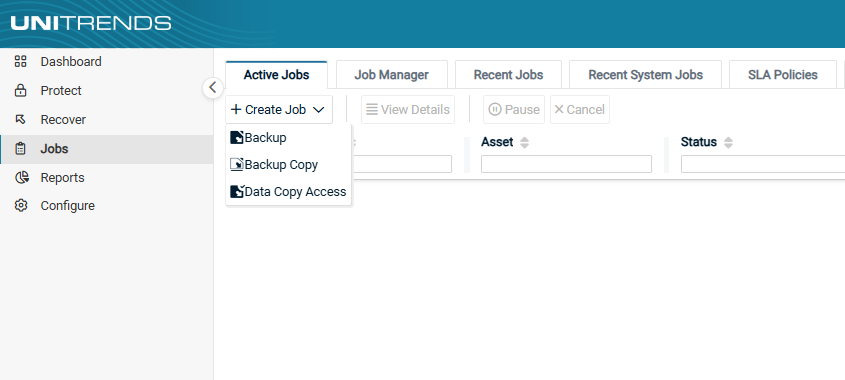
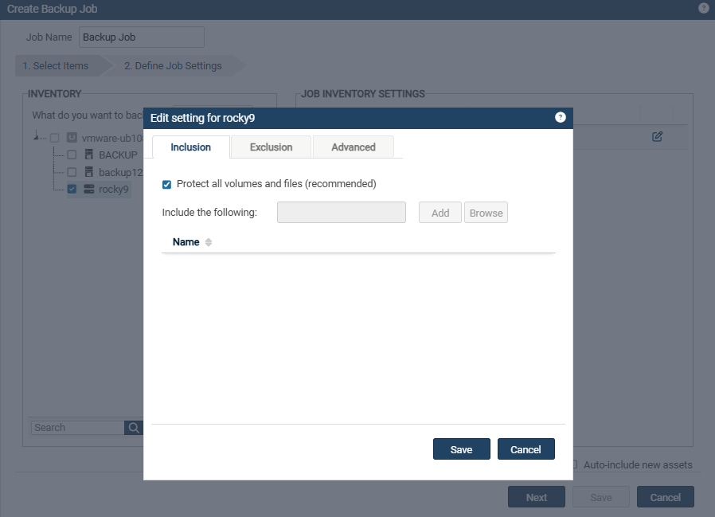
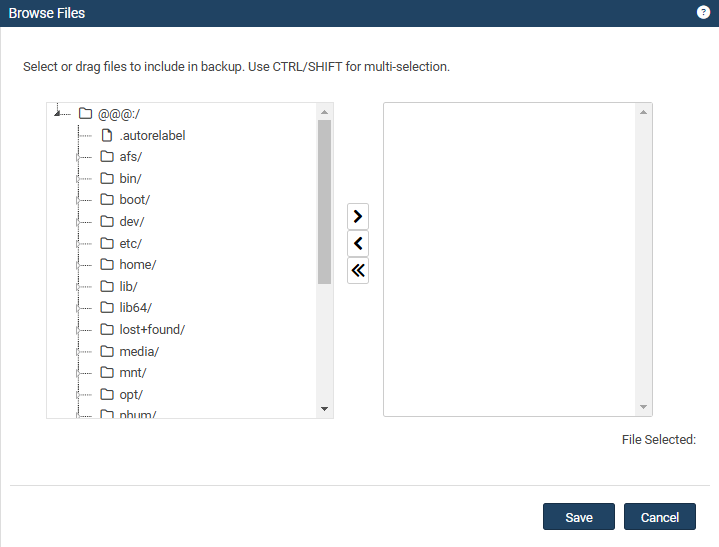

# 파일 레벨 백업(File-Level Backup)
  
파일 레벨 백업은 대상의 파일 시스템과 운영체제를 보호합니다.   
이 백업은 포함할 파일과 제외할 파일을 선택할 수 있습니다.   

파일 레벨 백업은 물리 대상(Windows, Linux)을 지원하며,   
가상머신(VM)의 경우 호스트 레벨 백업 또는 파일 레벨 백업 중 하나를 선택할 수 있습니다.
 * 호스트 레벨 백업 : 파일, 가상 하드웨어, 애플리케이션 데이터 모두 백업을 수행합니다.
 * 파일 레벨 백업 : 가상머신(VM)을 물리 대상으로 간주하고 파일 및 애플리케이션 백업을 수행합니다.
  

###### ▪ 파일 레벨 백업 요구사항
※ 파일 레벨 백업을 위해서는 대상 시스템에 Unitrends 에이전트를 설치해야 합니다. 
에이전트 설치 절차는 운영체제에 따라 다르므로, 자세한 내용은 [Unitrends 에이전트 설치 가이드]를 참고하세요.  
에이전트 설치 후, [에이전트 기반의 백업 대상 추가] 페이지를 참조하여 대상을 유니트렌드 어플라이언스에 추가한 다음,
백업 정책을 생성합니다.

###### [파일 백업 정책 설정 단계]
###### ⟦파일 백업 정책 설정 단계⟧
(1) <b>Jobs → +Create Job</b> 버튼을 클릭하여 <b>Backup</b>을 선택합니다.  

(2) 좌측 <b>INVENTORY</b> 영역에서 토글을 열어 백업 대상을 선택합니다.   
* 백업 대상을 등록된 이름으로 찾으려면 아래 <b>Search</b> 필드를 사용하세요. 
* 기본적으로 유니트렌드에 등록된 대상만 나열됩니다. 
* <i><b>What do you want to backup?</b></i>에서 백업 유형을 선택합니다. 
    * ex) File Level, Image Level, VMware, SQL 등  

(3) 우측 <b>JOB INVENTORY SETTINGS</b>의 <b>Edit</b>을 눌러 포함하거나 제외할 백업 경로를 선택합니다. 
(대상 시스템 전체를 백업하는 경우, 이 단계는 넘어가도 됩니다.)  
   * <b>Inclusion</b> : 백업받을 파일 및 폴더를 선택하는 곳입니다. 이외 경로는 자동으로 제외됩니다. 
   * 기본적으로 체크되어 있는 <b>Protected all volumes and files(recommended)</b>를 체크 해제한 후, 활성화 된 <b>Browse</b>를 눌러 선택합니다. 
   * <b>Exclusion</b> : 백업에서 제외할 파일 및 폴더를 선택하는 곳입니다. 이외 경로는 자동으로 포함됩니다. 
   * <b>Advanced</b> : 추가 설정을 하는 곳이며, 보통의 경우 따로 설정할 부분은 없습니다.(Windows 대상 제외) 
        * 정책 대상이 Windows인 경우,  
 

(4) <b>Browse</b>를 클릭하면 파일트리 구조로 좌측에 백업 대상이 나열되며, 아래 3가지의 버튼을 조작하여 특정 파일 및 폴더를 선택합니다. 
   * <b>>버튼</b> : 특정 파일/폴더를 Inclusion 및 Exclusion에 포함 
   * <b><버튼</b> : 특정 파일/폴더를 Inclusion 및 Exclusion에 제외 
   * <b><<버튼</b> : 특정 파일/폴더 선택을 초기화 

(5) 설정을 완료했다면, <b>Save → Save → Next</b>를 클릭하여 넘어갑니다. 
(6) Job Name을 입력합니다. 
   * 기본값은 'Backup Job'으로 입력됩니다. 
&nbsp; &nbsp; &nbsp; &nbsp; - 기본값이 아닌 사용자가 관리 용이한 이름으로 설정하는 것을 권장합니다. 
   * 백업 정책을 Now(즉시 백업)으로 설정하게 되면 Job Name은 'On-Demand'로 자동 설정됩니다. 
(7) <b>JOB DETAIL</b> 부분은 [상세 스케줄 설정 방법]를 참고하세요. 
(8) 설정 완료되었다면 <b>Save</b>를 눌러 정책 생성을 완료하세요.  

방금 만든 파일 레벨 백업 정책은 <b>Jobs → Job Manager</b>에서 확인 및 관리할 수 있습니다.      

