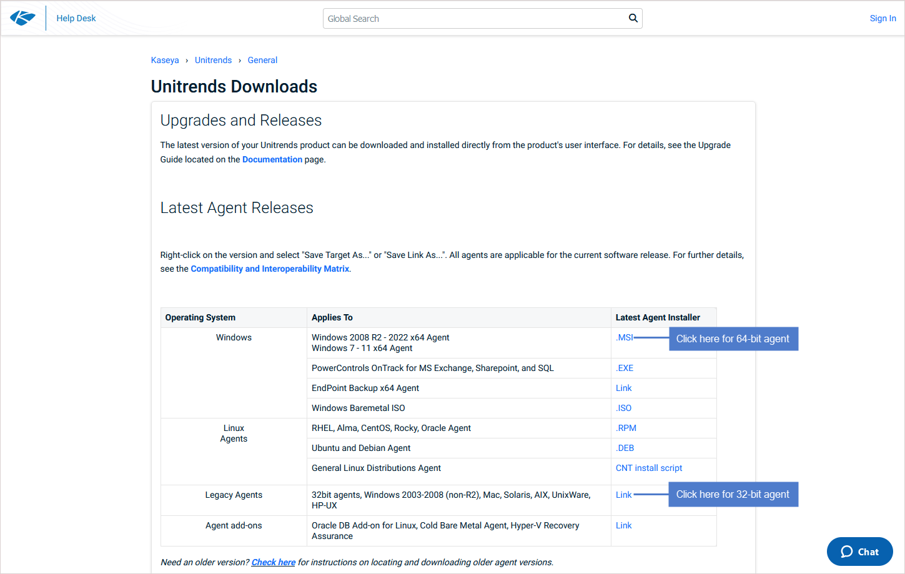
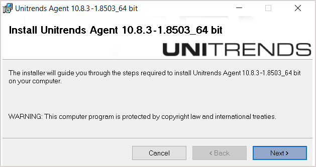
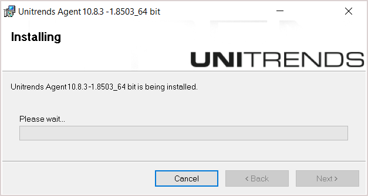
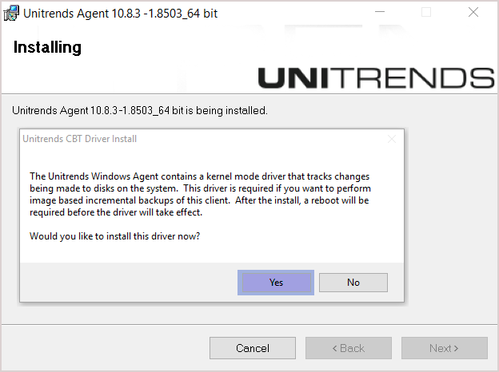
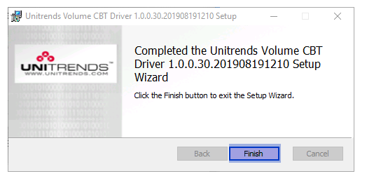
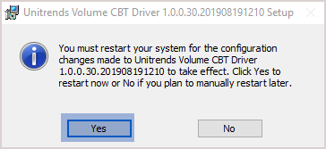

# Windows 에이전트 설치

Windows 대상을 백업하려면 해당 Windows에 에이전트를 설치해야 합니다. 
이 에이전트는 <b>파일 백업(File-Level), 이미지 백업(Image-Level) 및 애플리케이션 백업(application)</b>을 실행하는 데 필요합니다.  

###### 에이전트 설치 전 요구사항
Windows 에이전트를 설치하기 전에 아래 요구사항을 충족해야 합니다. 

① Unitrends 어플라이언스와 에이전트 버전 호환성 
* 10.8.1 버전부터, 에이전트 설치 프로그램보다 Unitrends 어플라이언스 버전이 더 낮을 경우 오류가 발생할 수 있습니다. 
② 관리자 권한 
* 에이전트를 설치하려는 사용자는 <b>Windows 관리자 권한</b>을 가지고 있어야 합니다. 
③ 디스크 여유공간 
* Windows 시스템 드라이브(일반적으로 C:\)에 <b>약 1100MB의 여유 공간</b>이 필요합니다. 
④ Windows VSS(Volume Shadow Copy Service)
* Windows VSS framework가 설치되어 있어야 합니다. 
⑤ VSS Writer 요구사항
애플리케이션 백업을 위해 다음 VSS Writer가 필요합니다.: 
* Exchange : VSS Exchange Writer
* SQL Server : VSS SQL Writer
* Hyper-V : VSS Hyper-V Writer
⑥ 포트 요구사항
* 에이전트는 <b>1743, 1745, 888/TCP 포트</b>를 사용합니다. 해당 포트가 다른 프로세스에 의해 사용되면 안됩니다.
⑦ 방화벽 관련 제한
* Unitrends는 방화벽을 통한 백업을 공식적으로 지원하지 않습니다.
* 서버 보안 및 백신 프로그램이 실행 중이라면, [방화벽 예외처리]를 참조해주세요.

###### 에이전트 보안 페어링 요구사항
10.6.6 버전부터 Unitrends 어플라이언스와 Windows 에이전트는 보안 페어링(secure pairing)을 지원합니다. 
이 페어링은 TLS(Transport Layer Security)를 사용해 데이터를 암호화하고, 연결을 인증합니다. 
보안 페어링 기능은 다음 조건을 충족해야 실행됩니다.:

① 버전 조건
* Unitrends 어플라이언스와 에이전트는 모두 10.6.6 버전 이상이어야 합니다.
* Unitrends 어플라이언스 버전은 에이전트 버전과 같거나 높아야 합니다.

② 업그레이드 조건
* 에이전트 버전을 업그레이드하기 전에 반드시 Unitrends 어플라이언스를 먼저 업그레이드해야 합니다.
* 10.6.6 버전 이상의 에이전트를 Unitrends 어플라이언스에서 백업하려고 하면 백업 작업이 실패합니다.

③ 페어링 실패 시 대처
* 10.6.9 이전 버전의 에이전트에서 업그레이드하는 경우, 페어링이 완료되기 전(최대 2시간)에는 백업 작업이 실패할 수 있습니다.

④ 클러스터 백업
* Hyper-V 클러스터, SQL 클러스터 또는 파일 서버 클러스터를 백업하려면 10.6.9 이상 버전의 에이전트가 필요합니다.
* Unitrends 어플라이언스와 클러스터는 동일한 시간대를 사용해야 합니다.

⑤ Windows XP, 2003, Vista 예외
* 이러한 운영체제를 백업하려면 <b>10.6.7 버전의 에이전트</b>를 설치해야 합니다. 해당 버전은 보안 페어링 기능을 비활성화합니다.

###### Windows 에이전트 설치 방법

(1) MSI 에이전트 파일 다운로드
* [Unitrends Downloads] 페이지에서 적합한 에이전트 설치 파일을 다운로드하세요.:
    * 32비트 시스템: Unitrends_Agentx86.msi
    * 64비트 시스템: Unitrends_Agentx64.msi

(2) MSI 파일 실행
* 다운로드한 MSI 파일(Unitrends_Agentx86.msi 또는 Unitrends_Agentx64.msi) 을 더블 클릭하여 설치 프로그램을 실행합니다.

(3) 설치 진행
* <b>Next</b>버튼을 클릭하여 설치를 진행합니다.
* **설치 중간에 <b>Cancel</b>버튼을 눌러 설치를 중단할 수 있습니다.

(4) 버전 확인
* 설치 중 <b>"The currently installing agent version is newer than the appliance version"</b> 메시지가 나타나면 <b>Yes</b>를 눌러 설치를 진행합니다.

(5) Volume CBT 드라이버 설치
① 드라이버 설치 선택
   * 설치 중 Windows Volume CBT 드라이버 설치 여부를 묻는 창이 나타납니다. 
   * <b>Yes</b>를 선택하여 드라이버를 설치합니다.
   * 이 드라이버는 이미지 증분(Incremental) 백업을 지원합니다.
   
   

② Volume CBT 드라이버 설치 상태 
   * <b>최신 드라이버가 이미 설치된 경우</b>: 드라이버 설치 창이 표시되지 않으며, 기존 드라이버가 사용됩니다.
   * 이전 드라이버가 설치된 경우: 새 버전을 설치하거나, 기존 버전을 유지할 옵션이 제공됩니다.
③ 드라이버 활성화 
   * 드라이버 설치 후에는 <b>Windows 시스템을 재부팅</b>하여 드라이버를 활성화해야 합니다.
   * Windows 시스템 재부팅은 최초 한번만 진행되며, 에이전트 설치 직후에 진행하지 않아도 됩니다.
      * Volume CBT 드라이버는 Windows 시스템이 재부팅해야 활성화됩니다.
   

###### 설치 후
(1) 설치 위치
* 에이전트는 Windows 시스템 드라이브(일반적으로 C:\)의 C:\PCBP 디렉토리에 설치됩니다.
(2) Volume CBT 드라이버 설치 여부 확인
* Volume CBT 드라이버를 설치한 경우:
    * 설치 완료 후 <b>Rebboot</b> 창이 표시됩니다.
    * 재부팅이 필요한 경우, <b>Yes</b>를 클릭하여 즉시 재부팅하거나 <b>No</b>를 클릭하여 나중에 재부팅할 수 있습니다.
   

###### 설치 후 주의사항
(1) 증분 백업 지원
* Volume CBT 드라이버가 설치되지 않거나 활성화되지 않으면 <b>이미지 증분 백업은 지원되지 않습니다.</b>
* 이 경우 모든 증분 백업 작업은 자동으로 <b>전체(Full) 백업으로 전환</b>됩니다.

(2) 드라이버 독립성
* Windows 에이전트와 Volume CBT 드라이버는 별도의 패키지로 설치됩니다.
* 에이전트를 제거해도 드라이버는 자동으로 제거되지 않으며, <b>제어판 → 프로그램 추가/제거<b>에서 uvcbt.msi를 수동으로 제거해야 합니다.

(3) 설치 파일 위치
* C:\PCBP\Installers 디렉토리에 uvcbt.msi 파일이 저장됩니다. 언제든지 이 파일을 실행하여 Volume CBT 드라이버를 다시 설치할 수 있습니다.   

